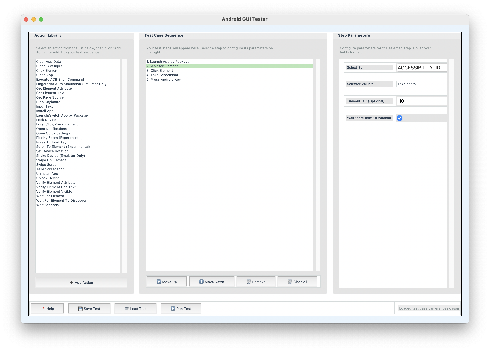

# Android GUI Tester

A simple desktop tool I built for running automated tests on Android devices. It helps you create and execute basic test sequences through a straightforward interface.



## Main Features

- Create test sequences by selecting from common Android actions
- Configure basic parameters for each action
- Save and load test cases
- Run tests on connected Android devices
- View test results in real-time

## What You'll Need

- Python 3.x
- Android SDK with ADB
- Appium-Python-Client
- An Android device with USB debugging enabled

## Quick Start

1. **Get the code:**
```bash
git clone https://github.com/rugveddarwhekar/android_tester.git
cd android_tester
```

2. **Install requirements:**
```bash
pip install -r requirements.txt
```

3. **Run the setup script** (recommended for first-time users):
```bash
python3 setup.py
```

4. **Configure your environment:**
   - Connect your Android device via USB
   - Enable USB Debugging in Developer Options
   - Start Appium Server: `appium`
   - Run setup script again to verify everything is working

5. **Launch the GUI:**
```bash
python3 main.py
```

## Basic Usage

1. **Connect your Android device** and enable USB debugging
2. **Start Appium Server** (default: http://localhost:4723)
3. **Launch the GUI** by running `python3 main.py`
4. **Create a test case**:
   - Select actions from the left panel
   - Configure parameters using the right panel
   - Arrange the sequence using the center panel
5. **Save your test case** for later use
6. **Run the test** and view results

### New User-Friendly Features

- **Interactive Help**: Hover over actions and parameters for detailed explanations
- **Help Button**: Comprehensive help dialog with getting started guide, selector explanations, and troubleshooting tips
- **Welcome Message**: Helpful introduction for new users
- **Visual Guidance**: Clear instructions in each panel
- **Enhanced Descriptions**: Detailed explanations for Android-specific terms and concepts

### Quick Tips for New Users

- Start with simple actions like "Click Element" and "Input Text"
- Use the "Help" button for detailed guidance
- Hover over any field to see helpful hints
- Use TEXT selectors for visible elements (easiest to start with)
- Add "Wait For Element" steps before clicking elements that might not be immediately visible

## Project Structure

```
android_tester/
├── actions/     # Test actions
├── config/      # Settings
├── data/        # Test cases
├── gui/         # Interface
├── reports/     # Results
├── runner/      # Test execution
├── utils/       # Helpers
└── main.py      # Start here
```

## Current Features

1. **Basic Interface**
   - Simple action selection
   - Parameter configuration
   - Test sequence management

2. **Test Execution**
   - Run tests in background
   - Basic error handling
   - Simple logging

3. **Device Integration**
   - ADB command support
   - Device connection
   - Package listing

## Known Limitations

- Works with one device at a time
- Basic error handling
- Limited action types
- No cloud features
- No CI/CD integration

## Planned Updates

I'm working on:
- Adding more test actions
- Improving error handling
- Better test reporting
- Basic multi-device support

## Troubleshooting

### Common Issues

#### "Driver initialization failed"
This is the most common error. Here's how to fix it:

1. **Check device connection:**
   ```bash
   adb devices
   ```
   You should see your device listed as "device" (not "unauthorized")

2. **Verify Appium server:**
   ```bash
   appium
   ```
   Start Appium server in a separate terminal

3. **Check capabilities configuration:**
   - Edit `config/capabilities.json`
   - Set `appium:deviceName` to your device ID
   - Verify other settings are correct

4. **Run the setup script:**
   ```bash
   python3 setup.py
   ```
   This will diagnose and help fix common issues

#### "ADB not found"
Install Android SDK platform-tools and add to PATH:
- **macOS/Linux:** `export PATH=$PATH:$ANDROID_HOME/platform-tools`
- **Windows:** Add `%ANDROID_HOME%\platform-tools` to PATH

#### "Cannot connect to Appium server"
Start Appium server:
```bash
npm install -g appium
appium
```

#### "No devices found"
- Connect device via USB
- Enable USB Debugging in Developer Options
- Authorize USB debugging on device when prompted

### Getting Help

Found an issue or have a question? [Open an issue](https://github.com/rugveddarwhekar/android_tester/issues) and I'll take a look. 